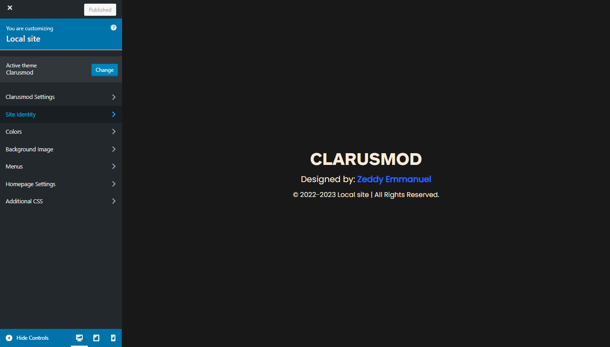

# ClarusMod Customizer

ClarusMod Customizer is a custom WordPress theme built on top of ClarusMod with extended customization options for users.

## Features

- New Overhaul Design Interface of the Customizer Section
- Custom Panel Section that allows Child Panels
- Custom Control
    - Toggle Switch Custom Control
    - TinyMce Custom Control
    - URL Custom Control
    - Plain Text Custom Control
    - Select Boxicons Custom Control
    - Select Category Custom Control

## Getting Started

### Prerequisites

- WordPress (minimum version: 5.9.4)
- PHP (minimum version: 7.4)

### Installation

1. Download the theme as a ZIP file.
2. In your WordPress dashboard, navigate to "Appearance" → "Themes."
3. Click on "Add New" and then "Upload Theme."
4. Upload the ZIP file and activate the theme.

### Customization

- Clarusmod comes with built in custom controls, and with it, you can change the style or functionality of your wordpress theme and see the changes in real time.
- So far, here are the custom controls I have added:
    - Toggle Switch Custom Control - Creates a toggle Switch you can use to disable or enable settings.
    - TinyMce Custom Control - Creates a rich Text Editor using the TinyMCE Textarea.
    - URL Custom Control - Creates an input field specifically for URLs.
    - Plain Text Custom Control - It just displays a plain text in the customizer and doesn't do anything. Can be used to give more information.
    - Select Boxicons Custom Control - Creates a dropdown of icons allowing users to select an icon of their choice.
    - Select Category Custom Control - Creates a dropdown of all the categories present on the wordpress site.

## Built With

- At the Moment, this theme uses only the Boxicons library to display icons the site. There is also a custom control that utilizes the library to allow users select from the list of available Icons.

## Contributing

We welcome contributions from the community! If you'd like to contribute to ClarusMod Customizer, please follow these steps:

1. Fork the repository.
2. Create a new branch for your feature/bug fix: `git checkout -b feature/your-feature-name`.
3. Make your changes and commit them: `git commit -m "Your commit message"`.
4. Push your changes to your fork: `git push origin feature/your-feature-name`.
5. Create a pull request to the `main` branch of this repository.

Please make sure to follow our [Code of Conduct](CODE_OF_CONDUCT.md) when contributing.

## License

This project is licensed under the [GNU License](LICENSE).

## Author

- [Zeddy Emmanuel](https://zeddyemy.github.io)

## Acknowledgments

This project was inspired by the work of many talented developers. While I was unable to find the original source of the CSS file that helped me change the default look of the WordPress Customizer side panel, I would like to extend my gratitude to all those who have contributed to the WordPress community and shared their knowledge and expertise. Your work has been a great source of inspiration for me and has helped me create this project. Thank you!
